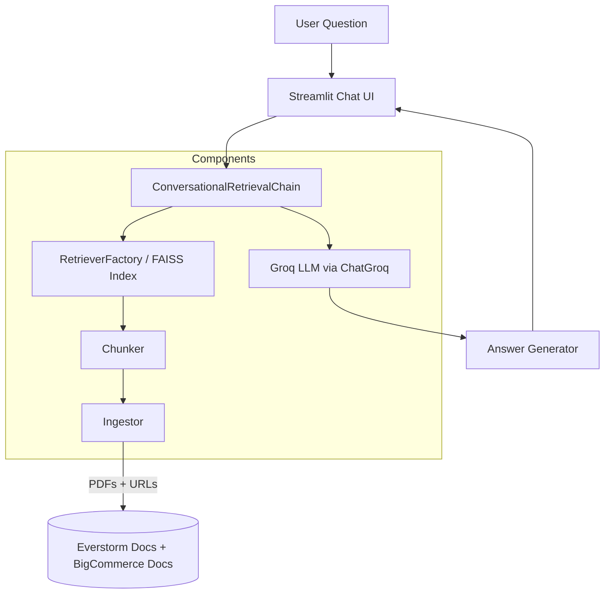

# 🧠 Customer Support Chatbot (RAG + Streamlit + Groq)

A **Retrieval-Augmented Generation (RAG)** chatbot built with **LangChain**, **Groq LLMs**, and **Streamlit**.  
It answers customer support questions using **Everstorm PDFs** and **BigCommerce developer docs** as its source of truth to reduce hallucinations and guesswork.

---

## 🚀 Overview

This project demonstrates a _production-grade_ RAG pipeline wrapped in a lightweight Streamlit app:

- **Document ingestion** from local PDFs and online URLs
- **Semantic chunking** for embedding-ready text splits
- **Vector indexing** using FAISS for fast retrieval
- **LLM reasoning** via Groq’s hosted models (e.g., `llama-3.3-70b-versatile`)
- **Conversational memory** to retain chat context
- **Transparent sources** — users can view and download every document used

---

## 🧩 System Architecture



## Components

| Component            | File                       | Description                                                                                                           |
| -------------------- | -------------------------- | --------------------------------------------------------------------------------------------------------------------- |
| **Ingestor**         | `src/ingestor.py`          | Loads PDFs and webpages (via LangChain loaders). Tracks all document sources for transparency.                        |
| **Chunker**          | `src/chunker.py`           | Splits raw documents into ~300-token overlapping chunks for efficient embeddings.                                     |
| **RetrieverFactory** | `src/retriever_factory.py` | Builds a FAISS vector index from chunks using `HuggingFaceEmbeddings`, enabling top-k semantic retrieval.             |
| **Chain**            | `src/chain.py`             | Assembles the RAG pipeline via `ConversationalRetrievalChain` and connects to a Groq LLM (`llama-3.3-70b-versatile`). |
| **App**              | `app.py`                   | Streamlit front-end. Handles chat, caches the chain, and exposes source docs and URLs in a sidebar.                   |

## Running Locally

### 1. Install dependencies

```bash
pip install -r requirements.txt
```

### 2. Install Groq Key

Create .streamlit/secrets.toml:

```toml
GROQ_API_KEY = "your_groq_api_key_here"
```

You can get a Groq API key [here](https://groq.com/).

### 3. Start the app

```bash
streamlit run app.py
```

Open http://localhost:8501 in your browser.

## Data Sources

The chatbot grounds its responses on:

- Local PDFs under data/Everstorm\_\*.pdf
- Online BigCommerce developer pages:
  - [Shipping Documentation](https://developer.bigcommerce.com/docs/store-operations/shipping)
  - [Refunds Documentation](https://developer.bigcommerce.com/docs/store-operations/orders/refunds)

All sources appear in the sidebar, with “Download” buttons to inspect the actual reference materials.

## Tech Stack

| Layer     | Tech                                       |
| --------- | ------------------------------------------ |
| UI        | Streamlit                                  |
| LLM       | Groq Cloud (`ChatGroq`)                    |
| Retrieval | FAISS + HuggingFace Embeddings             |
| Framework | LangChain Core / Community                 |
| Storage   | In-memory (cached via `st.cache_resource`) |
| Language  | Python 3.9+                                |

## Example Interaction

```yaml
You: What is the refund policy for cancelled orders?
Bot: According to the BigCommerce documentation, refunds can be issued via the Orders → Refunds API endpoint.
      [source: https://developer.bigcommerce.com/docs/store-operations/orders/refunds]
```

## Appendix

Author: [Omkar Ubale](https://www.omkarubale.com/)

License: MIT
